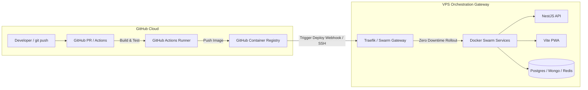

# ADR 0002: Managed CI/CD (GitHub Actions) vs. Self-Hosted Jenkins & VPS as Orchestration Gateway

* **Status:** Accepted
* **Deciders:** System Architect / DevOps Lead
* **Date:** 2026-08-06

---

## Context and Problem Statement

As client MVPs grow from initial setup to active development, engineering teams must decide where build pipelines, image compilation, and integration testing occur.

While our baseline boilerplate includes an embedded Jenkins server for self-contained, zero-external-dependency setups, building Docker images and running Playwright E2E tests directly on a low-cost VPS ($10–$30/month) introduces resource contention. A multi-stage `docker build` or Playwright test suite can spike CPU to 100% and consume available RAM, risking degradation or downtime for live production services (MongoDB, PostgreSQL, APIs).

Furthermore, modern Developer Experience (DX) relies heavily on native pull request (PR) checks, automated code review feedback, and friction-free pipeline execution available in SaaS CI/CD platforms like **GitHub Actions**, **GitLab CI**, or **CircleCI**.

This ADR evaluates the DX, cost implications, and architectural positioning of utilizing cloud CI/CD runners while framing the VPS strictly as an **Orchestration Gateway & Runtime Target**.

---

## Decision Drivers

* **Developer Experience (DX):** Immediate PR checks, inline error reporting on GitHub, automated dependency scanning, and zero Jenkins maintenance overhead.
* **Production Protection & Resource Isolation:** Guaranteeing that build tasks (`npm run build`, `docker build`, Playwright E2E) do not starve production services on the VPS.
* **Cost Efficiency & Predictability:** Maximizing free tier allocations (e.g., GitHub Actions' 2,000 free minutes/month) before incurring infrastructure costs.
* **Architectural Separation of Concerns:** Defining the VPS role as a focused **Orchestration Gateway** (Traefik ingress, Docker Swarm execution, environment secrets, and volume persistence) rather than a heavy build machine.

---

## Considered Options

1. **Option 1: 100% Self-Hosted Jenkins / Local Pipeline on VPS**
   * *Build location:* VPS Host
   * *Pros:* Fully self-contained, zero external SaaS dependencies, zero third-party subscription cost risk.
   * *Cons:* Consumes VPS CPU/RAM during builds; requires Jenkins UI maintenance, plugin security updates, and disk pruning management.

2. **Option 2: Hybrid Cloud CI/CD (GitHub Actions) + VPS as Orchestration Gateway (Chosen)**
   * *Build location:* GitHub-hosted runners (Ubuntu Linux)
   * *Pros:* Zero load on production VPS during builds; native GitHub PR integration; builds published to GitHub Container Registry (GHCR) or deployed via SSH/Webhook to the VPS Gateway.
   * *Cons:* Requires internet connectivity for deployment webhooks/SSH keys; consumes GitHub Actions minute quota after 2,000 free min/mo.

3. **Option 3: Managed Cloud PaaS (Vercel + AWS ECS + Managed Cloud DBs)**
   * *Build location:* Cloud Vendor SaaS
   * *Pros:* Zero server administration.
   * *Cons:* Prohibitive baseline costs ($100–$500+/month) for early-stage client MVPs, unpredictable bandwidth/database egress charges.

---

## Cost & Developer Experience (DX) Evaluation

| Metric / Dimension | Self-Hosted Jenkins (VPS) | GitHub Actions (Hybrid) | Managed Cloud PaaS (AWS/Vercel) |
| :--- | :--- | :--- | :--- |
| **Monthly Base Cost** | $0 (included in VPS) | $0 (Free 2,000 min/mo) | $100 – $500+/mo |
| **Overage Cost Rate** | Requires larger VPS (+$20/mo) | $0.008 / min (Linux runner) | High usage/bandwidth tiers |
| **VPS CPU/RAM Impact** | High (Build spikes hit production) | **Zero (0% impact on VPS)** | Zero |
| **DX & PR Integration** | Moderate (Requires Jenkins setup) | **Native & Instant** | Native |
| **Registry Dependency** | Local Docker Daemon | GHCR / Docker Hub | Cloud Native Registry |
| **Maintenance Burden** | High (Jenkins updates, disk cleanup) | **Zero** | Zero |

### Cost Breakdown Analysis for GitHub Actions:
- **Free Tier:** 2,000 build minutes/month for free accounts (50,000 min/mo for Enterprise).
- **Average Build Duration:** ~2 minutes for NestJS / Vite Docker builds (with layer caching).
- **Capacity:** ~1,000 automated builds per month under the free tier without spending a single dollar.
- **Overage Cost:** If quota is exceeded, 500 extra build minutes cost only **$4.00/month**.

---

## Architectural Model: The VPS as an Orchestration Gateway

Under the recommended hybrid model, the VPS responsibility shifts from a build server to an **Orchestration Gateway**:

### Core Roles of the VPS Orchestration Gateway:
1. **Ingress & SSL Termination:** Traefik handling reverse proxying, Let's Encrypt certificates, and HTTP/HTTPS routing.
2. **Runtime Container Lifecycle:** Docker Swarm executing `docker stack deploy` with zero-downtime rolling updates.
3. **Data Persistence & Backups:** Managing persistent volumes and executing local volume backups (`backup-volumes.sh`).
4. **Environment & Secret Resolution:** Housing production `.env` secrets populated securely via `manage-env.js`.

---

## Decision Outcome

**Chosen Option:** **Option 2 — Hybrid Cloud CI/CD (GitHub Actions) + VPS as Orchestration Gateway**

### Guidelines for Implementers:
* **For Small/Isolated Setups or Air-Gapped Environments:** Use the built-in `setup/jenkins/` pipeline.
* **For Active Product Teams & Standard Workflows:** Configure GitHub Actions workflows (`.github/workflows/deploy.yml`) to build images in cloud runners and push to GHCR, calling the VPS Orchestration Gateway via SSH/Webhook for instant deployment.

---

## Related Documentation

* 🧠 **[ADR 0001: Docker Swarm over Kubernetes](./0001-why-docker-swarm-over-k8s.md)**
* 🏗️ **[CI/CD & Jenkins Pipeline Guide](../cicd/jenkins-guide.md)**
* 🌐 **[Architecture & Traefik Routing](../infrastructure/architecture.md)**
