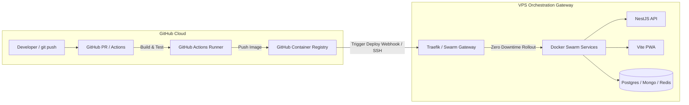

# ADR 0002: CI/CD Gestionado (GitHub Actions) vs. Jenkins Local y VPS como Gateway de Orquestación

* **Estado:** Aceptado (Accepted)
* **Decisores:** Arquitecto de Sistemas / Líder de DevOps
* **Fecha:** 2026-08-06

---

## Contexto y Declaración del Problema

A medida que los MVPs de los clientes evolucionan desde la configuración inicial hacia un desarrollo activo, los equipos de ingeniería deben decidir dónde se ejecutan las pipelines de compilación, construcción de imágenes y pruebas de integración.

Aunque nuestro boilerplate incluye un servidor Jenkins integrado para entornos aislados y sin dependencias externas, construir imágenes Docker y ejecutar suites de pruebas E2E con Playwright directamente en un VPS de bajo coste ($10–$30/mes) introduce competencia por los recursos. Una compilación multi-stage de Docker o pruebas de Playwright pueden elevar la CPU al 100% y agotar la RAM disponible, arriesgando inestabilidades en las aplicaciones en producción (MongoDB, PostgreSQL, APIs).

Además, la experiencia de desarrollo moderna (DX) depende en gran medida de comprobaciones nativas en las solicitudes de extracción (PRs), comentarios automatizados en revisiones de código y una ejecución fluida en plataformas SaaS como **GitHub Actions**, **GitLab CI** o **CircleCI**.

Este ADR evalúa la DX, las implicaciones de costes y la postura arquitectónica de usar runners de CI/CD en la nube, encuadrando el VPS estrictamente como un **Gateway de Orquestación y Runtime**.

---

## Factores Decisivos

* **Experiencia del Desarrollador (DX):** Comprobaciones inmediatas en PRs, informes inline en GitHub, escaneo de dependencias y cero mantenimiento del servidor Jenkins.
* **Protección de Producción e Aislamiento de Recursos:** Garantizar que las tareas pesadas de compilación (`docker build`, Playwright E2E) no agoten los recursos del VPS en producción.
* **Eficiencia y Previsibilidad de Costes:** Maximizar la asignación gratuita (p. ej., 2.000 minutos gratuitos/mes en GitHub Actions) antes de incurrir en costes.
* **Separación Arquitectónica de Responsabilidades:** Definir el rol del VPS como un **Gateway de Orquestación** (ingress Traefik, ejecución Docker Swarm, variables de entorno y volúmenes).

---

## Opciones Consideradas

1. **Opción 1: Pipeline 100% Self-Hosted con Jenkins en el VPS**
   * *Ubicación del build:* Servidor VPS
   * *Pros:* Totalmente autocontenido, cero dependencia de SaaS externo, cero coste adicional de suscripción.
   * *Contras:* Consume CPU/RAM del VPS durante las compilaciones; requiere mantenimiento de la interfaz de Jenkins, actualizaciones de seguridad de plugins y limpieza de disco.

2. **Opción 2: Modelo Híbrido — CI/CD en la Nube (GitHub Actions) + VPS como Gateway de Orquestación (Elegida)**
   * *Ubicación del build:* Runners gestionados de GitHub (Ubuntu Linux)
   * *Pros:* Cero impacto en CPU/RAM de producción durante las compilaciones; integración nativa con PRs en GitHub; imágenes publicadas en GHCR y despliegue mediante SSH/Webhook.
   * *Contras:* Requiere conectividad a internet para webhooks/claves SSH; consume la cuota de minutos de GitHub Actions tras 2.000 min/mes.

3. **Opción 3: PaaS Cloud Totalmente Gestionada (Vercel + AWS ECS + Bases de Datos Cloud)**
   * *Ubicación del build:* Nube del Proveedor SaaS
   * *Pros:* Cero administración de servidores.
   * *Contras:* Costes base elevados ($100–$500+/mes) para MVPs en etapa inicial.

---

## Matriz Comparativa de Costes y DX

| Métrica / Dimensión | Jenkins Self-Hosted (VPS) | GitHub Actions (Híbrido) | Cloud PaaS (AWS/Vercel) |
| :--- | :--- | :--- | :--- |
| **Coste Base Mensual** | $0 (incluido en VPS) | **$0 (2.000 min/mes gratis)** | $100 – $500+/mes |
| **Tarifa por Exceso** | Requiere VPS más grande (+$20/mes) | **$0,008 / min (Linux)** | Tarifas altas de tráfico/uso |
| **Impacto CPU/RAM en VPS** | Alto (Picos afectan la producción) | **Cero (0% de impacto)** | Cero |
| **DX e Integración con PR** | Moderado (Configuración Jenkins) | **Nativo e Instantáneo** | Nativo |
| **Mantenimiento de CI** | Alto (Actualizaciones, limpiezas) | **Cero** | Cero |

---

## Modelo Arquitectónico: El VPS como Gateway de Orquestación

---

## Resultado de la Decisión

**Opción Elegida:** **Opción 2 — CI/CD Híbrido en la Nube (GitHub Actions) + VPS como Gateway de Orquestación**
