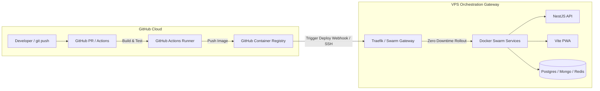

# ADR 0002: CI/CD Gerenciado (GitHub Actions) vs. Jenkins Local & VPS como Gateway de Orquestração

* **Status:** Aceito (Accepted)
* **Decisores:** Arquiteto de Sistemas / Liderança de DevOps
* **Data:** 2026-08-06

---

## Contexto e Declaração do Problema

À medida que os MVPs de clientes evoluem do setup inicial para desenvolvimento ativo, as equipes de engenharia precisam decidir onde os pipelines de build, compilação de imagens e testes de integração devem ser executados.

Embora nosso boilerplate inclua um servidor Jenkins embarcado para ambientes isolados e sem dependências externas, compilar imagens Docker e executar suítes de testes E2E com Playwright diretamente em uma VPS de baixo custo ($10–$30/mês) introduz disputa por recursos. Um `docker build` multi-stage ou testes com Playwright podem elevar a CPU a 100% e esgotar a RAM disponível, arriscando instabilidades nas aplicações em produção (MongoDB, PostgreSQL, APIs).

Além disso, a experiência de desenvolvimento moderna (DX) depende fortemente de checagens nativas em Pull Requests (PRs), feedback automatizado de revisão de código e execução fluida de pipelines disponíveis em plataformas SaaS como **GitHub Actions**, **GitLab CI** ou **CircleCI**.

Este ADR avalia a DX, implicações de custos e o posicionamento arquitetural do uso de runners CI/CD em nuvem, enquadrando a VPS estritamente como um **Gateway de Orquestração e Runtime**.

---

## Fatores Decisivos

* **Experiência do Desenvolvedor (DX):** Checagens imediatas de PR, relatórios inline no GitHub, varredura de dependências e zero manutenção de servidor Jenkins.
* **Proteção de Produção & Isolamento de Recursos:** Garantir que tarefas pesadas de build (`docker build`, Playwright E2E) não sobrecarreguem os serviços em produção na VPS.
* **Eficiência e Previsibilidade de Custos:** Maximizar cotas gratuitas (ex: 2.000 minutos gratuitos/mês do GitHub Actions) antes de incorrer em custos.
* **Separação Arquitetural de Responsabilidades:** Definir o papel da VPS como um **Gateway de Orquestração** (ingress Traefik, execução Docker Swarm, variáveis de ambiente e volumes).

---

## Opções Consideradas

1. **Opção 1: Pipeline 100% Self-Hosted com Jenkins na VPS**
   * *Local do build:* Servidor VPS
   * *Prós:* Totalmente autocontido, zero dependência de SaaS externo, zero custo adicional de assinatura.
   * *Contras:* Consome CPU/RAM da VPS durante builds; requer manutenção da interface do Jenkins, atualizações de plugins e limpeza de disco.

2. **Opção 2: Modelo Híbrido — CI/CD em Nuvem (GitHub Actions) + VPS como Gateway de Orquestração (Escolhida)**
   * *Local do build:* Runners gerenciados do GitHub (Ubuntu Linux)
   * *Prós:* Zero impacto na CPU/RAM da produção durante builds; integração nativa com PRs no GitHub; imagens enviadas para o GHCR e deploy via SSH/Webhook.
   * *Contras:* Requer conectividade com a internet para webhooks/chaves SSH; consome a cota de minutos do GitHub Actions após 2.000 min/mês.

3. **Opção 3: PaaS Cloud Totalmente Gerenciada (Vercel + AWS ECS + Bancos Cloud)**
   * *Local do build:* Nuvem do Provedor SaaS
   * *Prós:* Zero administração de servidores.
   * *Contras:* Custos base elevados ($100–$500+/mês) para MVPs de estágio inicial.

---

## Matriz Comparativa de Custos & DX

| Métrica / Dimensão | Jenkins Self-Hosted (VPS) | GitHub Actions (Híbrido) | Cloud PaaS (AWS/Vercel) |
| :--- | :--- | :--- | :--- |
| **Custo Base Mensal** | $0 (incluído na VPS) | **$0 (2.000 min/mês grátis)** | $100 – $500+/mês |
| **Taxa por Excesso** | Requer VPS maior (+$20/mês) | **$0,008 / min (Linux)** | Tarifas altas de tráfego/uso |
| **Impacto CPU/RAM na VPS** | Alto (Picos atingem a produção) | **Zero (0% de impacto)** | Zero |
| **DX & Integração com PR** | Moderado (Setup Jenkins) | **Nativo e Instantâneo** | Nativo |
| **Manutenção do CI** | Alta (Upgrades, limpezas) | **Zero** | Zero |

---

## Modelo Arquitetural: A VPS como Gateway de Orquestração

---

## Resultado da Decisão

**Opção Escolhida:** **Opção 2 — CI/CD Híbrido em Nuvem (GitHub Actions) + VPS como Gateway de Orquestração**
