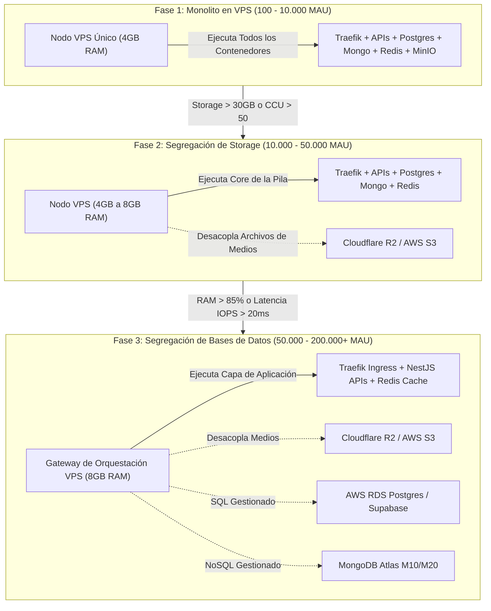

# ADR 0003: Límites de Capacidad del VPS y Migración Gradual a Servicios Nube Gestionados (S3, RDS)

* **Estado:** Aceptado (Accepted)
* **Decisores:** Arquitecto de Sistemas / Líder de DevOps / Gerencia de Ingeniería
* **Fecha:** 2026-08-06

---

## Contexto y Declaración del Problema

Nuestra arquitectura base utiliza una pila Docker Swarm ejecutándose en un único VPS de bajo coste ($5–$24/mes) para atender MVPs de clientes en etapas iniciales. Ejecutar servicios unificados (Traefik, NestJS, MongoDB, Postgres, Redis, MinIO, RabbitMQ, n8n) en un único VPS ahorra entre el **85% y el 96%** en costes de infraestructura en comparación con plataformas SaaS totalmente gestionadas con bajos volúmenes de tráfico (100 MAU).

Sin embargo, a medida que la aplicación crece en Usuarios Activos Mensuales (MAU), Usuarios Concurrentes (CCU) y tráfico de datos, un VPS mononodo eventualmente encontrará cuellos de botella de hardware:
1. **Agotamiento de Memoria (RAM):** El OOM Killer finalizando procesos de base de datos cuando la memoria combinada supera la RAM del host.
2. **Cuellos de Botella de I/O de Disco:** Escrituras intensas en la base de datos compitiendo con archivos de registro y lecturas en el almacenamiento local.
3. **Agotamiento de Almacenamiento:** Archivos de medios de usuarios llenando los discos NVMe/SSD locales.
4. **Alta Disponibilidad (HA) y Cumplimiento:** Ausencia de conmutación por error multirregión automatizada, replicación multi-AZ o Point-In-Time-Recovery (PITR).

Este ADR establece detonantes operativos concretos para definir **CUÁNDO** y **CÓMO** desacoplar la pila unificada del VPS y migrar componentes específicos (Almacenamiento de Objetos, PostgreSQL/RDS, MongoDB Atlas) a servicios gestionados en la nube.

---

## Factores Decisivos

* **Economía Unitaria y Hitos Financieros:** Maximizar el ROI en las fases iniciales y migrar servicios solo cuando los ingresos del negocio justifiquen costes de nube más elevados.
* **Detonantes de Saturación de Recursos:** Señales medibles de hardware (CPU %, RAM %, latencia de IOPS de disco, ocupación de almacenamiento).
* **Métricas de Escala de Carga:** MAU (Usuarios Activos Mensuales), CCU (Usuarios Concurrentes / Conexiones de Pico) y RPS (Solicitudes por Segundo).
* **Gestión de Riesgo Operativo:** Seguridad de datos, respaldos continuos automatizados, PITR y garantías de SLA.

---

## Estructura de Migración: Modelo en 3 Fases

---

## Desglose de Capacidad y Métricas por Fase

### Fase 1: Pila Unificada en el VPS (Validación de MVP)

* **Tráfico Objetivo:** **100 a 10.000 MAU**
* **Usuarios Concurrentes (CCU):** **1 a 50 usuarios concurrentes**
* **Throughput de Pico:** **< 50 Solicitudes / Segundo (RPS)**
* **Límite de Base de Datos:** **< 25 GB en total**
* **Límite de Almacenamiento de Medios:** **< 20 GB de medios/assets**

#### Configuración y Coste:
- **Alojamiento:** 1x Nodo VPS (2 vCPU, 4GB RAM, 40–80GB SSD).
  - Hetzner CAX11/CX23 (~$5,00/mes) O DigitalOcean Basic ($24,00/mes) O AWS EC2 t4g.small ($15,00/mes).
- **Pila:** 100% self-hosted en Docker Swarm (Traefik, NestJS, Postgres, Mongo, Redis, MinIO, RabbitMQ, n8n).
- **Coste Mensual Total:** **$5,00 – $24,00 / mes**

---

### Fase 2: Segregación de Almacenamiento de Objetos (Fase de Crecimiento)

* **Detonantes (Cualquiera de los siguientes):**
  - Almacenamiento de disco local supera los **30 GB** (o 70% de la capacidad total del disco).
  - El tráfico de carga/descarga de medios genera conflicto de IOPS de disco con consultas de escritura en la base de datos.
* **Tráfico Objetivo:** **10.000 a 50.000 MAU**
* **Usuarios Concurrentes (CCU):** **50 a 250 usuarios concurrentes**
* **Throughput de Pico:** **50 a 150 Solicitudes / Segundo (RPS)**

#### Configuración y Coste:
- **Compute y Bases de Datos:** 1x Nodo VPS (2-4 vCPU, 4-8GB RAM) ejecutando APIs, MongoDB, Postgres, Redis (~$24,00/mes).
- **Migración de Almacenamiento de Objetos:** Desacopla el MinIO local hacia **Cloudflare R2** (Tasa cero de tráfico de salida, $0,015/GB-mes) o **AWS S3**.
- **Coste Mensual Total:** **$26,00 – $35,00 / mes**
  - *Ahorro vs SaaS Gestionado:* **~80% más económico** que SaaS en la nube ($180+/mes).

---

### Fase 3: Segregación de Bases de Datos (Fase de Alta Escala)

* **Detonantes (Cualquiera de los siguientes):**
  - Consumo de RAM de las bases de datos supera la memoria del host (Uso de RAM del VPS consistentemente **> 85%**).
  - Latencia de escritura de IOPS supera los **20ms**, causando cuellos de botella en las APIs.
  - Requisito de negocio para **Point-In-Time-Recovery (PITR)**, replicación multi-AZ o SLA de 99.99%.
* **Tráfico Objetivo:** **50.000 a 200.000+ MAU**
* **Usuarios Concurrentes (CCU):** **250 a 2.000+ usuarios concurrentes**
* **Throughput de Pico:** **> 200 Solicitudes / Segundo (RPS)**

#### Configuración y Coste:
- **Capa de Aplicación e Ingress (VPS):** 1x o 2x Nodos VPS actuando como **Gateway de Orquestación** (Traefik + APIs NestJS + Caché Redis) (~$24,00 – $48,00/mes).
- **Base de Datos Relacional Gestionada:** AWS RDS PostgreSQL `db.t4g.medium` o Supabase Pro (~$30,00 – $60,00/mes).
- **Base de Datos NoSQL Gestionada:** MongoDB Atlas `M10` / `M20` Dedicated Cluster (~$57,00 – $100,00/mes).
- **Storage Gestionado:** Cloudflare R2 / AWS S3 (~$10,00 – $20,00/mes).
- **Coste Mensual Total:** **$121,00 – $228,00 / mes**

---

## Matriz Resumen de Decisión

| Fase de la Arquitectura | Rango de MAU | Usuarios Concurrentes (CCU) | Detonante / Restricción Primaria | Infraestructura Primaria | Coste Mensual Estimado |
| :--- | :--- | :--- | :--- | :--- | :--- |
| **Fase 1: Monolito en VPS** | 100 – 10.000 | 1 – 50 CCU | Validación de MVP, datos < 25GB | 1x VPS (4GB RAM) | **$5 – $24 / mes** |
| **Fase 2: Segregación de Storage** | 10.000 – 50.000 | 50 – 250 CCU | Disco local > 30GB o conflicto I/O | VPS + Cloudflare R2 / S3 | **$26 – $35 / mes** |
| **Fase 3: Segregación de Bases** | 50.000 – 200.000+ | 250 – 2.000+ CCU | RAM > 85%, latencia I/O > 20ms, HA SLA | VPS Gateway + AWS RDS + Mongo Atlas + R2 | **$121 – $228 / mes** |

---

## Resultado de la Decisión

**Estrategia Elegida:** **Modelo de Migración Gradual en 3 Fases**
