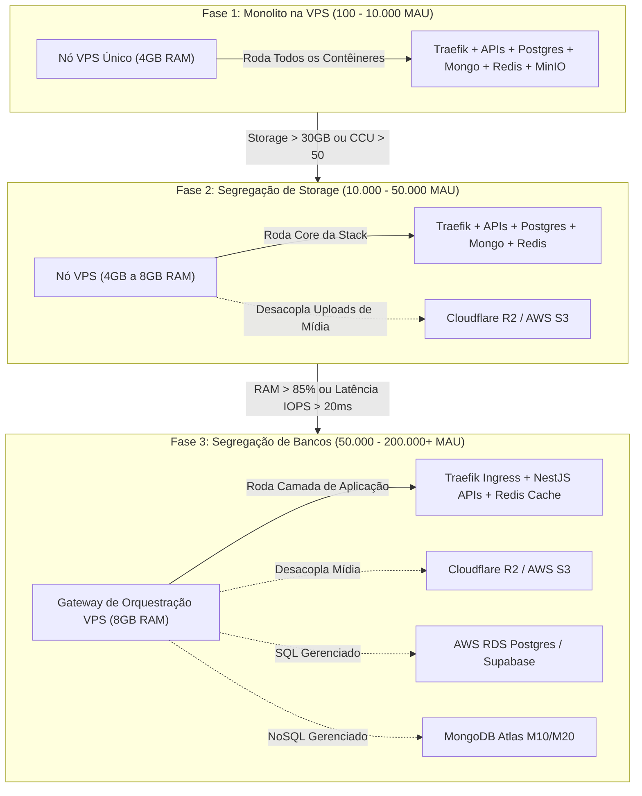

# ADR 0003: Limites de Capacidade da VPS & Migração Gradual para Serviços Nuvem Gerenciados (S3, RDS)

* **Status:** Aceito (Accepted)
* **Decisores:** Arquiteto de Sistemas / Liderança de DevOps / Gerência de Engenharia
* **Data:** 2026-08-06

---

## Contexto e Declaração do Problema

Nossa arquitetura base utiliza uma stack Docker Swarm rodando em uma única VPS de baixo custo ($5–$24/mês) para atender MVPs de clientes em estágios iniciais. Rodar serviços unificados (Traefik, NestJS, MongoDB, Postgres, Redis, MinIO, RabbitMQ, n8n) em uma única VPS economiza entre **85% e 96%** em custos de infraestrutura em comparação com plataformas SaaS totalmente gerenciadas em baixos volumes de tráfego (100 MAU).

No entanto, à medida que a aplicação cresce em Usuários Ativos Mensais (MAU), Usuários Simultâneos (CCU) e tráfego de dados, uma VPS single-node eventualmente encontrará gargalos de hardware:
1. **Esgotamento de Memória (RAM):** O OOM Killer encerrando processos de banco de dados quando a memória combinada excede a RAM do host.
2. **Gargalos de I/O de Disco:** Escritas intensas no banco de dados competindo com arquivos de log e leituras no armazenamento de arquivos local.
3. **Esgotamento de Armazenamento:** Arquivos de mídia de usuários preenchendo os discos NVMe/SSD locais.
4. **Alta Disponibilidade (HA) e Compliance:** Ausência de failover multirregião automatizado, replicação multi-AZ ou Point-In-Time-Recovery (PITR).

Este ADR estabelece gatilhos operacionais concretos para definir **QUANDO** e **COMO** desacoplar a stack unificada da VPS e migrar componentes específicos (Armazenamento de Objetos, PostgreSQL/RDS, MongoDB Atlas) para serviços gerenciados na nuvem.

---

## Fatores Decisivos

* **Economia Unitária & Marcos Financeiros:** Maximizar o ROI nas fases iniciais e migrar serviços apenas quando a receita do negócio justificar custos de nuvem mais elevados.
* **Gatilhos de Saturação de Recursos:** Sinais mensuráveis de hardware (CPU %, RAM %, latência de IOPS de disco, ocupação de armazenamento).
* **Métricas de Escala de Carga:** MAU (Usuários Ativos Mensais), CCU (Usuários Simultâneos / Conexões de Pico) e RPS (Requisições por Segundo).
* **Gestão de Risco Operacional:** Segurança dos dados, backups contínuos automatizados, PITR e garantias de SLA.

---

## Estrutura de Migração: Modelo em 3 Fases

---

## Detalhamento de Capacidade e Métricas por Fase

### Fase 1: Stack Unificada na VPS (Validação de MVP)

* **Tráfego Alvo:** **100 a 10.000 MAU**
* **Usuários Simultâneos (CCU):** **1 a 50 usuários simultâneos**
* **Throughput de Pico:** **< 50 Requisições / Segundo (RPS)**
* **Limite de Banco de Dados:** **< 25 GB no total**
* **Limite de Armazenamento de Mídia:** **< 20 GB de mídia/assets**

#### Configuração & Custo:
- **Hospedagem:** 1x Nó VPS (2 vCPU, 4GB RAM, 40–80GB SSD).
  - Hetzner CAX11/CX23 (~$5,00/mês) OU DigitalOcean Basic ($24,00/mês) OU AWS EC2 t4g.small ($15,00/mês).
- **Stack:** 100% self-hosted em Docker Swarm (Traefik, NestJS, Postgres, Mongo, Redis, MinIO, RabbitMQ, n8n).
- **Custo Mensal Total:** **$5,00 – $24,00 / mês**

---

### Fase 2: Segregação de Armazenamento de Objetos (Fase de Crescimento)

* **Gatilhos (Qualquer um dos seguintes):**
  - Armazenamento de disco local excede **30 GB** (ou 70% da capacidade total do disco).
  - O tráfego de upload/download de mídia gera disputa de IOPS de disco com consultas de escrita no banco de dados.
* **Tráfego Alvo:** **10.000 a 50.000 MAU**
* **Usuários Simultâneos (CCU):** **50 a 250 usuários simultâneos**
* **Throughput de Pico:** **50 a 150 Requisições / Segundo (RPS)**

#### Configuração & Custo:
- **Compute & Bancos de Dados:** 1x Nó VPS (2-4 vCPU, 4-8GB RAM) rodando APIs, MongoDB, Postgres, Redis (~$24,00/mês).
- **Migração de Armazenamento de Objetos:** Desacopla o MinIO local para o **Cloudflare R2** (Taxa zero de tráfego de saída, $0,015/GB-mês) ou **AWS S3**.
- **Custo Mensal Total:** **$26,00 – $35,00 / mês**
  - *Economia vs SaaS Gerenciado:* **~80% mais barato** do que SaaS em nuvem ($180+/mês).

---

### Fase 3: Segregação de Bancos de Dados (Fase de Alta Escala)

* **Gatilhos (Qualquer um dos seguintes):**
  - Consumo de RAM dos bancos de dados excede a memória do host (Uso de RAM da VPS consistentemente **> 85%**).
  - Latência de escrita de IOPS excede **20ms**, causando gargalos nas APIs.
  - Exigência de negócios para **Point-In-Time-Recovery (PITR)**, replicação multi-AZ ou SLA de 99.99%.
* **Tráfego Alvo:** **50.000 a 200.000+ MAU**
* **Usuários Simultâneos (CCU):** **250 a 2.000+ usuários simultâneos**
* **Throughput de Pico:** **> 200 Requisições / Segundo (RPS)**

#### Configuração & Custo:
- **Camada de Aplicação & Ingress (VPS):** 1x ou 2x Nós VPS atuando como **Gateway de Orquestração** (Traefik + APIs NestJS + Cache Redis) (~$24,00 – $48,00/mês).
- **Banco Relacional Gerenciado:** AWS RDS PostgreSQL `db.t4g.medium` ou Supabase Pro (~$30,00 – $60,00/mês).
- **Banco NoSQL Gerenciado:** MongoDB Atlas `M10` / `M20` Dedicated Cluster (~$57,00 – $100,00/mês).
- **Storage Gerenciado:** Cloudflare R2 / AWS S3 (~$10,00 – $20,00/mês).
- **Custo Mensal Total:** **$121,00 – $228,00 / mês**

---

## Matriz Resumo de Decisão

| Fase da Arquitetura | Faixa de MAU | Usuários Simultâneos (CCU) | Gatilho / Restrição Primária | Infraestrutura Primária | Custo Mensal Estimado |
| :--- | :--- | :--- | :--- | :--- | :--- |
| **Fase 1: Monolito na VPS** | 100 – 10.000 | 1 – 50 CCU | Validação de MVP, dados < 25GB | 1x VPS (4GB RAM) | **$5 – $24 / mês** |
| **Fase 2: Segregação de Storage** | 10.000 – 50.000 | 50 – 250 CCU | Disco local > 30GB ou conflito I/O | VPS + Cloudflare R2 / S3 | **$26 – $35 / mês** |
| **Fase 3: Segregação de Bancos** | 50.000 – 200.000+ | 250 – 2.000+ CCU | RAM > 85%, latência I/O > 20ms, HA SLA | VPS Gateway + AWS RDS + Mongo Atlas + R2 | **$121 – $228 / mês** |

---

## Resultado da Decisão

**Estratégia Escolhida:** **Modelo de Migração Gradual em 3 Fases**
