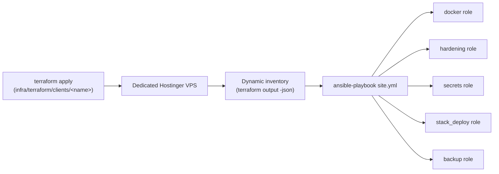

# ADR 0004: Terraform + Ansible for Replicable, Dedicated-VPS-per-Client Provisioning

* **Status:** Accepted
* **Deciders:** System Architect / DevOps Lead
* **Date:** 2026-08-30

---

## Context and Problem Statement

The boilerplate was designed from the start to accelerate MVP setup for new
clients (see `CLIENT_NAME` in `.env.example`, and the README's "accelerate
setup for new client MVPs" framing), but onboarding a client has always been
a manual, undocumented sequence: provision a VPS by hand, SSH in, clone the
repo, run `harden-vps.sh`, `init.sh`, and `npm run deploy:infra` in the
right order. Nothing prevents a step from being skipped, run out of order,
or configured inconsistently between clients — and a security fix applied
to one client's VPS by hand has no guarantee of reaching the next one.

This ADR follows directly from the security audit that produced the Docker
secrets, socket-proxy, and UFW/`DOCKER-USER` fixes tracked in
[Security & Backup Policy](../infrastructure/security-passwords.md): those
fixes are only as good as their consistent application to every client VPS,
which a manual process cannot guarantee at scale.

---

## Decision Drivers

* **Consistency:** every client VPS should be provisioned and hardened the
  same way, with drift detectable (`terraform plan`) rather than discovered
  in an incident.
* **Isolation:** client data/secrets must never share infrastructure with
  another client's — ruling out a multi-tenant shared VPS.
* **Auditability:** infrastructure changes should go through the same
  review discipline (PRs, CI lint) as application code.
* **Reuse over rewrite:** the existing hardening/deploy scripts were just
  reviewed and fixed — the automation layer should orchestrate them, not
  duplicate their logic in a second, unverified implementation.

---

## Considered Options

1. **Keep the manual bash sequence, just document it better.**
   *Pros:* zero new tooling, zero learning curve.
   *Cons:* still no drift detection, still no state of what actually exists
   across clients, still relies on a human following steps correctly.

2. **Ansible only, no Terraform (assume the VPS already exists).**
   *Pros:* simpler, one tool instead of two.
   *Cons:* VPS creation itself stays manual/undocumented — the biggest
   source of inconsistency (server size, firewall rules, region) is
   untouched.

3. **Terraform (VPS provisioning) + Ansible (configuration/deploy), one
   dedicated VPS per client (Chosen).**
   *Pros:* full lifecycle as code, `terraform plan` shows drift before it
   happens, Ansible roles wrap the already-reviewed scripts instead of
   reimplementing them, clean audit trail via CI lint on every PR.
   *Cons:* two tools to learn, more moving parts than a single script.

4. **Multi-tenant shared VPS with per-client namespacing.**
   *Pros:* lower hosting cost per client.
   *Cons:* materially larger security surface (one client's compromised
   container can reach another's), contradicts the isolation driver above;
   rejected for this boilerplate's threat model.

---

## Decision Outcome

**Chosen Option:** **Terraform (Hostinger) + Ansible, one dedicated VPS
per client.**

* **Provider:** Hostinger (`hostinger/hostinger` Terraform provider) —
  chosen for this project's existing hosting relationship. The module
  (`infra/terraform/modules/vps-client`) exposes the same input/output
  contract other providers would need (`client_name`, `ssh_public_key` →
  `server_id`, `public_ipv4`, `public_ipv6`), so a
  `modules/vps-client-hetzner` or `-digitalocean` sibling can be added
  later without touching per-client configuration. [ADR 0003](./0003-vps-capacity-limits-and-managed-service-migration-thresholds.md)'s
  cost analysis (originally framed around Hetzner/DigitalOcean/AWS pricing)
  still applies directionally — the capacity thresholds and migration
  triggers are about VPS resource limits in general, not tied to one
  vendor.
* **State:** remote backend required (S3-compatible or Terraform Cloud) —
  local state is explicitly disallowed for real clients (see
  `infra/terraform/README.md`).
* **Configuration:** Ansible roles call the existing, already-hardened
  scripts (`harden-vps.sh`, `manage-env.js`, `deploy.sh`) rather than
  reimplementing their logic as native tasks, except where a native module
  is both standard and lower-risk than shelling out (Docker package install
  via `apt`, Swarm init via `community.docker.docker_swarm`, secret
  patching, cron scheduling).
* **CI:** `.github/workflows/infra-lint.yml` runs `terraform validate`,
  `tflint`, `checkov`, `ansible-lint`, and `gitleaks` on every PR touching
  `infra/` or `setup/` — consistent with the GitHub Actions direction
  already chosen in [ADR 0002](./0002-cloud-ci-cd-vs-vps-orchestration-gateway.md)
  for anything that shouldn't run on a client's production VPS.

### Known Gaps (intentionally deferred)

* **No cloud-level firewall via Terraform — automated via Ansible instead.**
  The `hostinger/hostinger` provider (v0.1.x) exposes `hostinger_vps`,
  `hostinger_vps_ssh_key`, `hostinger_vps_post_install_script`, and
  `hostinger_dns_record`, but no firewall resource. Hostinger's underlying
  REST API does have firewall endpoints (`/api/vps/v1/firewall*`), so the
  `hostinger_firewall` Ansible role (runs on the control node, not the
  VPS) calls that API directly to create/update the firewall group and
  activate it on the client's VPS. This is **best-effort**: two
  conflicting descriptions of the rule request body were found during
  research — Hostinger's official Python SDK docs
  (`protocol`/`port`/`source`/`source_detail`) and an unofficial
  third-party "skills" repository (`protocol`/`port`/`source`/`action`,
  no `source_detail`). The official SDK shape was deliberately chosen over
  the third-party one. Within that chosen shape, the exact accepted enum
  values for `protocol`/`source` still could not be confirmed against the
  real OpenAPI spec in this environment (the spec file was too large to
  extract just that section reliably) — the role ships with a reasonable
  guess and documents that a rejected request (400/422) will have
  Hostinger's own error response list the accepted values, to be fed back
  into the role's defaults. Either way, this is
  defense-in-depth on top of `setup/security/harden-vps.sh` (UFW +
  fail2ban + `DOCKER-USER` chain + SSH key-only, applied by the
  `hardening` Ansible role), which is provider-independent and remains the
  primary defense regardless of whether the cloud firewall call succeeds.
  The hardening script was also extended to disable SSH password
  authentication (key-only) once at least one authorized key is confirmed
  present, since Hostinger provisions a root password by default unlike
  some other providers.
* No Molecule test coverage for the Ansible roles yet — the environment
  this was authored in had no Ansible/Docker-in-Docker test runner
  available, and shipping untested test scaffolding would be a false sense
  of safety. `ansible-lint` + `--syntax-check` in CI is the safety net
  until Molecule scenarios are added.
* Only one cloud provider (Hostinger) is implemented; multi-provider
  support is a structural placeholder, not a working feature yet.
* Backup encryption-at-rest at the remote destination is not automated
  (see [ADR 0005](./0005-docker-swarm-secrets.md) for the equivalent
  reasoning applied to runtime secrets) — generating and losing a backup
  encryption key unattended is a worse outcome than an unencrypted-but-
  access-controlled remote copy.

---

## Related Documentation

* 🧭 **[Client Onboarding Runbook](../infrastructure/client-onboarding-runbook.md)**
* 🌐 **[Terraform README](../../infra/terraform/README.md)**
* ⚙️ **[Ansible README](../../infra/ansible/README.md)**
* 🔒 **[ADR 0005: Docker Swarm Secrets](./0005-docker-swarm-secrets.md)**
* 🧠 **[ADR 0002: Cloud CI/CD vs. VPS Orchestration Gateway](./0002-cloud-ci-cd-vs-vps-orchestration-gateway.md)**
* 🧠 **[ADR 0003: VPS Capacity Limits & Managed Service Migration Thresholds](./0003-vps-capacity-limits-and-managed-service-migration-thresholds.md)**
