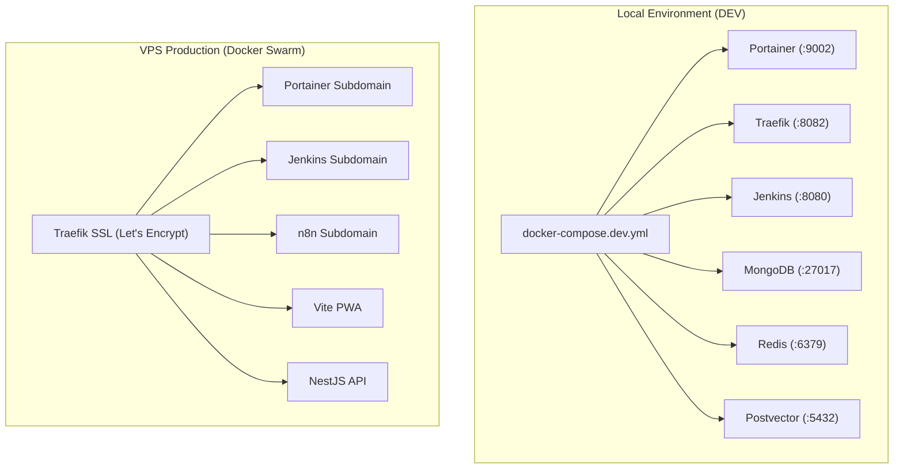

# 🌐 Area: Infrastructure & DevOps — Architecture and Environments

[← Back to Documentation Hub](../README.md)

---

## 🛠️ Infrastructure Overview

The infrastructure is engineered to support two execution modes: **Local Development (DEV)** and **VPS Production (PROD)**.



---

## 💻 1. Local Development Environment (DEV)

In DEV mode, there is no requirement for Docker Swarm initialization or Let's Encrypt SSL certificates. All containerized services run via `docker-compose.dev.yml` with exposed ports bound directly to `localhost`:

```bash
# Execute environment setup & spin up DEV stack
npm run setup
npm run dev:infra
```

### 🔌 Exposed Ports Table (DEV):
* **Portainer:** `http://localhost:9002`
* **Jenkins:** `http://localhost:8080`
* **Traefik Dashboard:** `http://localhost:8082`
* **MongoDB:** `localhost:27017`
* **Redis:** `localhost:6379`
* **Postvector (PostgreSQL + pgvector):** `localhost:5432`
* **RabbitMQ:** `localhost:5672` (Management: `localhost:15672`)
* **MinIO:** `localhost:9000` (Console: `localhost:9001`)
* **n8n:** `http://localhost:5678`
* **Chromium Remote Debug:** `localhost:9222`

---

## 🚀 2. Production Environment (PROD / VPS)

On the client's VPS, the stack runs on **Docker Swarm** with automatic SSL termination via **Let's Encrypt** (`letsencryptresolver`).

```bash
# On the VPS
sudo ./setup/security/harden-vps.sh
./setup/init.sh
npm run deploy:infra
```

> Before the first production deploy, set `ADMIN_ALLOWED_CIDRS` in `.env` to your team's real IP(s)/CIDR(s) — see [Security & Backup Policy](./security-passwords.md#-admin-panel-access). Without it, Portainer/Jenkins/RabbitMQ/MinIO panels stay unreachable by design (fail-closed default).

### 🔒 SSL Certificates & Traefik Ingress Routes
Traefik handles HTTP to HTTPS redirection and SSL renewal dynamically:
* `https://portainer.<DOMAIN_NAME>`
* `https://jenkins.<DOMAIN_NAME>`
* `https://n8n.<DOMAIN_NAME>`
* `https://api.<DOMAIN_NAME>`
* `https://<DOMAIN_NAME>`
